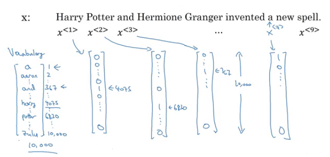
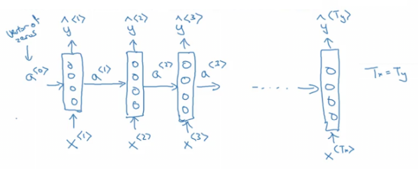
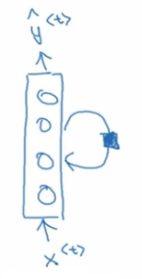
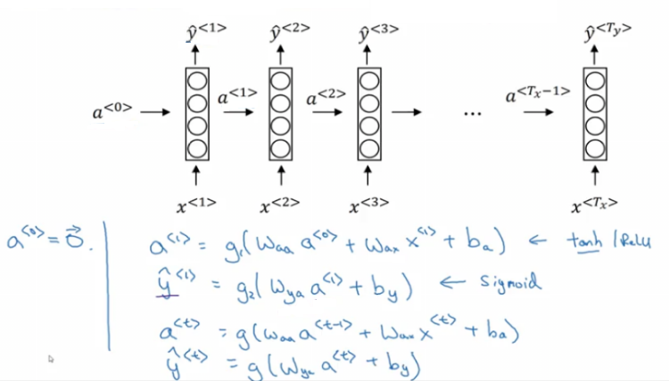
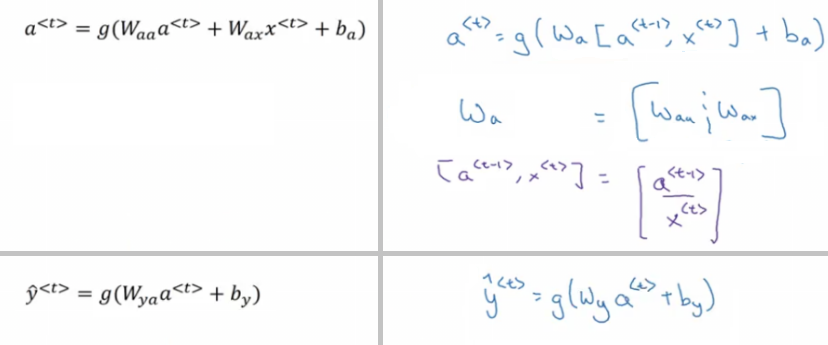
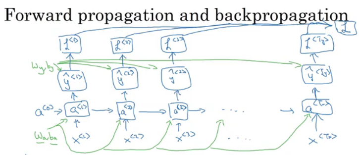
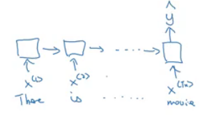
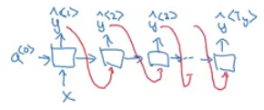
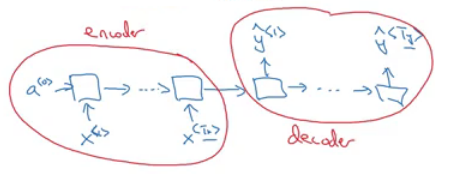

# Sequence Models

This is the fifth and final course of the deep learning specialization at [Coursera](https://www.coursera.org/specializations/deep-learning) which is moderated by [deeplearning.ai](http://deeplearning.ai/). The course is taught by Andrew Ng.

**<u>This page is just a draft right now.</u>**

## Table of contents
[TOC]

## Course summary
Here are the course summary as its given on the course [link](https://www.coursera.org/learn/nlp-sequence-models):

> This course will teach you how to build models for natural language, audio, and other sequence data. Thanks to deep learning, sequence algorithms are working far better than just two years ago, and this is enabling numerous exciting applications in speech recognition, music synthesis, chatbots, machine translation, natural language understanding, and many others. 
>
> You will:
> - Understand how to build and train Recurrent Neural Networks (RNNs), and commonly-used variants such as GRUs and LSTMs.
> - Be able to apply sequence models to natural language problems, including text synthesis. 
> - Be able to apply sequence models to audio applications, including speech recognition and music synthesis.
>
> This is the fifth and final course of the Deep Learning Specialization.

## Recurrent Neural Networks

> Learn about recurrent neural networks. This type of model has been proven to perform extremely well on temporal data. It has several variants including LSTMs, GRUs and Bidirectional RNNs, which you are going to learn about in this section.

### Why sequence models

- Sequence Models like RNN and LSTMs have greatly transformed learning on sequences in the past few years.
- Examples of sequence data in applications:
  - Speech recognition (**Sequence to sequence**):
    - X:           Wave sequence
    - Y:           Text sequence
  - Music generation (**one to sequence**):
    - X:           (Can be nothing or an integer)
    - Y:           Wave sequence
  - Sentiment classification (**sequence to one**):
    - X:          Text sequence
    - Y:           Integer rating from one to five
  - DNA sequence analysis (**sequence to sequence**):
    - X:           DNA sequence
    - Y:            DNA Labels
  - Machine translation (**sequence to sequence**):
    - X:            Text sequence (In a language)
    - Y:            Text sequence (In other language)
  - Video activity recognition (**Sequence to one**):
    - X:            Video frames
    - Y:             Label (Activity)
  - Name entity recognition  (**Sequence to sequence**):
    - X:            Text sequence
    - Y:             Label sequence
    - Can be used by seach engines to index different type of words inside a text.
- As you can see there are different data with different input and outputs - sequence or one - that can be learned by supervised learning models.
- There are different ways and models to tackle different sequence problem.

### Notation

- In this section we will discuss the notations that we will use through the course.
- **Motivating example**:
  - In the content of name entity recognition application let:
    - X: "Harry Potter and Hermoine Granger invented a new spell."
    - Y:   1   1   0   1   1   0   0   0   0
    - Both elements has a shape of 9. 1 means its a name, while 0 means its not a name.
- We will index the first element of X by X<1>, the second X<2> and so on.
  - X<1> = Harry
  - X<2> = Potter
- Similarly, we will index the first element of Y by Y<1>, the second Y<2> and so on.
  - Y<1> = 1
  - Y<2> = 1
- X<t> gets an element by index t.
- Tx is the size of the input sequence and Ty is the size of the output sequence.
  - Tx = Ty = 9 in the last example although they can be different in other problems than name entity one.
- X(i)<t><t> is the element t of the sequence i in the training. Similarly for Y
- Tx (i) is the size of the input sequence i.  It can be different across the sets. Similarly for Y
- **Representing words**:
  - We will now work in this course with **NLP** which stands for nature language processing. One of the challenges of NLP is how can we represent a word?
  - <u>The first thing</u> we need a **vocabulary** list that contains all the words in our target sets.
    - Example:
      - [a ... And   ... Harry ... Potter ... Zulu ]
      - Each word will have a unique index that it can be represented with.
      - The sorting here is by alphabetic order.
  - Vocabulary sizes in modern applications are from 30,000 to 50,000. 100,000 is not uncommon. Some of the bigger companies uses a million.
  - To build vocabulary list, you can read all the text you have and get m words with the most occurrence, or search online for m most occurrence words.
  - <u>The next step</u> is to create a one **hot encoding sequence** for each word in your dataset given the vocabulary you have created.
  - While converting, what if you meet a word thats not in your dictionary?
    - Well you can add a token in the vocabulary `<UNK>` which stands for unknown text and use its index in filling your one hot vector.
  - Full example can be found here:
    - 

### Recurrent Neural Network Model
- Why not a standard network for sequence problems? There are two problems:
  - Inputs, outputs can be different lengths in different examples!
    - This can be solved in normal NNs by paddings with the maximum lengths but its not a good solution.
  - Doesn't share features learned across different positions of text/sequence.
    - Using a feature sharing like in CNNs can significantly reduce the number of parameters in your model. Thats what we will do in RNNs.
- Recurrent neural networks doesn't have the two mentioned problems.
- Lets build a RNN that solves **name entity recognition** task:
  - 
  - In this problem Tx = Ty. In other problems where they aren't equal, the RNN architecture may be different.
  - a<0> is usually initialized with zeros, but some others may initialize it randomly in some cases.
  - There are three weight matrices here: Wax, Waa, and Wya with shapes:
    - Wax: (NoOfHiddenNeurons, nx)
    - Waa: (NoOfHiddenNeurons, NoOfHiddenNeurons)
    - Wax: (ny, NoOfHiddenNeurons)
- A lot of papers and books write the same architecture this way:
  - 
  - Its harder to interpreter. Its easier to roll this drawings to the unrolled version we have descried.
- In the discussed RNN architecture,  the current output y^t depends on the previous inputs and activations.
- Lets have this example ' He Said, "Teddy Roosevelt was a great president"  '. In this example Teddy is a person name but we know that from the word **President** that came after Teddy not from **He** and **said** that is before it.
- So limitation of the discussed architecture is that it learns from behind. To address this problem we will later discuss **Bidirectional** RNNs  (BRNNs).
- Now lets discuss the forward propagation equations on the discussed architecture:
  - 
  - The activation function of a is usually tanh or RELU and for y depends on your task choosing some activation functions like sigmoid and softmax. In name entity recognition task we are solving, we will use Sigmoid because we only have two classes.
- In order to help us develop complex RNN architectures, the last equations needs to be simplified a bit.
- **Simplified RNN notation**:
  - 
  - wa shape: (NoOfHiddenNeurons, NoOfHiddenNeurons + nx)
  - [a<t-1>, xt] shape: (NoOfHiddenNeurons + nx, 1)
### Backpropagation through time
- Lets see how backpropagation works with the RNN architecture we have developed.
- Often, Deep learning frameworks do backpropagation automatically for you. But its useful to know how it works especially in RNNs.
- Here is the graph:
  - 
  - Where wa, ba, wy, and by are shared across each element in a sequence.
- We will use the cross entropy loss function:
  - 
  - Where the first equation is the loss for one element and the loss for the whole sequence is given by the summation over all the calculated values.
- Graph with losses:
  - 
- The backpropagation here is called **backpropagation through time** because of the passed activation `a` from one sequence element to another.
### Different types of RNNs
- So far we have seen only one RNN architecture in which Tx equals TY always. In some other problems, they may not equal so we need different architectures.
- The ideas in this section was inspired by Andrej Karpathy [blog](http://karpathy.github.io/2015/05/21/rnn-effectiveness/). Mainly this image has all types:
  - 
- The architecture we have descried before is called **Many to Many**.
- In sentiment analysis problem, X is a text while Y is an integer that rangers from 1 to 5. The RNN architecture for that is **Many to One** as in Andrej Karpathy image.
  - 
- A **One to Many** architecture application would be music generation.
  - 
  - Note that starting the second layer we are feeding the generated output back to the network.
- There are another interesting architecture in **Many To Many**. Applications like machine translation inputs and outputs sequences have different lengths in most of the cases. So an alternative Many To Many architecture that fits the translation would be as follows:
  - 
  - There are an encoder and a decoder in the architecture. The encoder encodes the input sequence into one matrix and feed it to the decoder to generate the outputs. Encoder and decoder have different weight matrices.
- There are another architecture which is the **attention** architecture which we will talk about in chapter 3.
### Language model and sequence generation
- RNNs do very well in language model problems. In this section we will build a language model using RNNs.
- **What is a language model**
  - Lets say we are solving a speech recognition problem and some one says a sentence that can be interpreted into to two sentences:
    - The apple and **pair** salad
    - The apple and **pear** salad
  - **Pair** and **pear** sounds exactly the same, so how would a speech recognition application choose from the two.
  - Thats where the language models comes. It gives a probability for the two sentences and the application decides the best based on this probability.
- The job of a language model is given any sentence give a probability of that sentence. Also what is the next sentence probability given a sentence.
- **How to build language modeling with RNNs?**
  - The first thing it to get a **training set**: Large corpus of target language text.
  - Then tokenize this training set by getting the vocabulary and then one-hot each word.
  - Put an end of sentence token `<EOS>` with the vocabulary and include it with each converted sentence. Also like we have mentioned before use the token `<UNK>` for the unknown words.
- Given the sentence "Cats average 15 hours of sleep a day. `<EOS>`"
  - In training time we will use this:
    - 
    - We pass to 0 vector - One hot -  to the first layer.
  - The loss function is defined by cross entropy loss:
    - 
    - `i`  is for all elements in the training set.
- To use this model:
  1.  For predicting the chance of **next word**, we feed the sentence to the RNN and then get the final y^<t> hot vector and sort it by maximum probability.
  2. For taking the **probability of a sentence**, we compute this:
     - p(y<1>, y<2>, y<3>) = p(y<1>) * p(y<2> | y<1>) * p(y<3> | y<1>, y<2>)
     - This is simply feeding the sentence to the RNN and multiply the probability for the given word in all the output hot encoded.
### Sampling novel sequences
- After a sequence model is trained on a language model, to check what the model has learned you can apply it on a sample novel sequence.
- Lets see the steps of how we can sample a novel sequence from a trained sequence language model:
  1. Given this model:
     - 
  2. We first pass a<0> = zeros vector, and x<1> = zeros vector.
  3. Then we choose a prediction from y^<1> using random distribution. For example it could be "The".
     - In Numpy this can be made using: `numpy.random.choice`
     - This is the line where you get a random sentences each time you run a novel sequence.
  4. We pass the last predicted word with the calculated  a<1>
  5. We keep doing 3 & 4 steps for a fixed length or until we get the `<EOS>` token.
  6. You can reject any `<UNK>` token if you mind finding it in you output.
- So far we have build a word level language model. A **character** level language model also can be made.
- In the character level language model the vocabulary will contain `[a-zA-Z0-9]`, space, and some special characters.
- Cons of character level language model compared to the word level language model:
  - There will be no `<UNK>` token.
  - It can deal with any word.
- But main disadvantage you will have a larger sequences! and also more computationally expensive and harder to train.
### Vanishing gradients with RNNs
- ​
### Gated Recurrent Unit (GRU)
- ​
### Long Short Term Memory (LSTM)
- ​
### Bidirectional RNN
- ​
### Deep RNNs
- 

## Natural Language Processing & Word Embeddings

> Natural language processing with deep learning is an important combination. Using word vector representations and embedding layers you can train recurrent neural networks with outstanding performances in a wide variety of industries. Examples of applications are sentiment analysis, named entity recognition and machine translation.

### Introduction to Word Embeddings

#### Word Representation
- ​

#### Using word embeddings
- ​

#### Properties of word embeddings
- ​

#### Embedding matrix
- ​

### Learning Word Embeddings: Word2vec & GloVe

#### Learning word embeddings
- ​

#### Word2Vec
- ​

#### Negative Sampling
- ​

#### GloVe word vectors
- ​

### Applications using Word Embeddings

#### Sentiment Classification
- ​

#### Debiasing word embeddings
- 

## Sequence models & Attention mechanism

> Sequence models can be augmented using an attention mechanism. This algorithm will help your model understand where it should focus its attention given a sequence of inputs. This week, you will also learn about speech recognition and how to deal with audio data.

### Various sequence to sequence architectures

#### Basic Models
- ​

#### Picking the most likely sentence
- ​

#### Beam Search
- ​

#### Refinements to Beam Search
- ​

#### Error analysis in beam search
- ​

#### Bleu Score (optional)
- ​

#### Attention Model Intuition
- ​

#### Attention Model
- ​

### Speech recognition - Audio data

#### Speech recognition
- ​

#### Trigger Word Detection
- 

  
  
These Notes was made by [Mahmoud Badry](mailto:mma18@fayoum.edu.eg) @2018